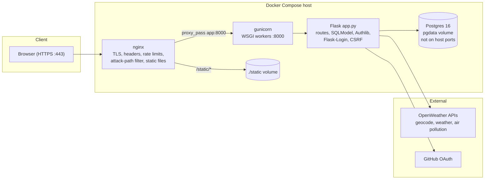
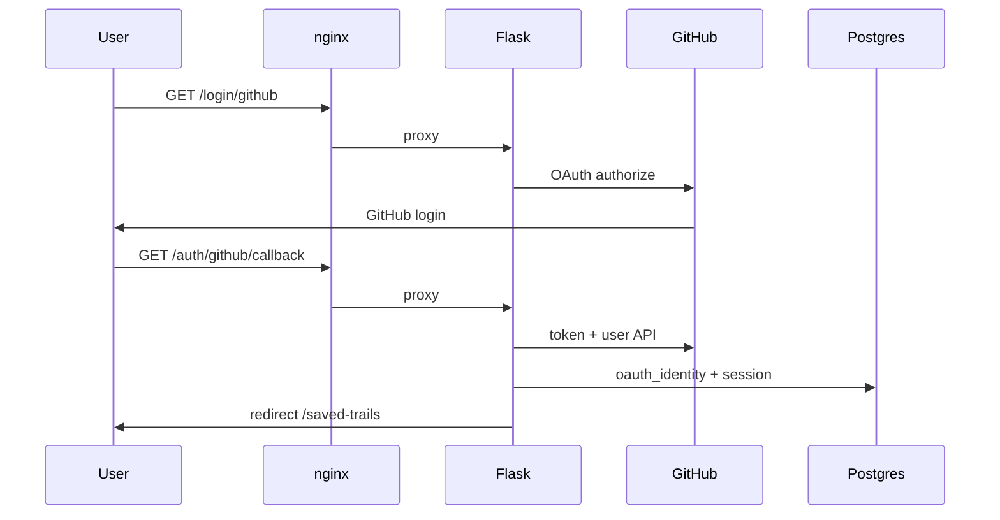
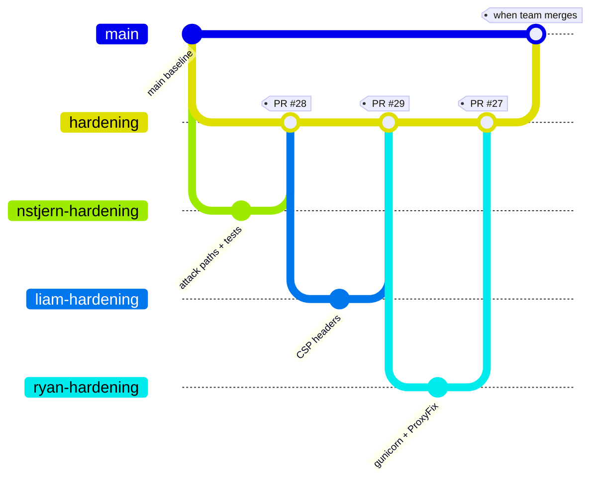

# Final Team Presentation — Trail Conditions Checker

**Team:** Cache Kings  
**Repo:** [TCSS506-CacheKings/Trail-checker](https://github.com/TCSS506-CacheKings/Trail-checker)  
**Presentation branch:** `hardening` (Week 8 production stack integrated here)  
**Slot:** ~12–15 minutes + Q&A (confirm exact length with instructor)  
**Speakers:** Ryan Belmonte (server), Liam Sipp (client), Nick Stjern (DB-and-security)

This document is the team script, slide outline, diagrams, demo checklist, and appendix. Every member should speak during the live presentation.

---

## Timing budget (~14 minutes)

| Segment | Lead speaker | Target |
|---------|--------------|--------|
| What you built (elevator) | Liam or Ryan | 1.5 min |
| Architecture + contracts | All three (split below) | 3.5 min |
| Live demo | Liam (UI); Ryan/Nick backup auth/stack | 4 min |
| What worked / what didn't | Rotate — one point each | 2 min |
| Git workflow + work split | Nick | 2 min |
| AI usage reflection | Each ~30–45 sec | 1.5 min |
| Buffer / handoff to Q&A | — | ~0.5 min |

**Discipline:** If running long, cut the Git graph slide and the OAuth sequence diagram; keep one topology diagram and the demo.

---

## 1. What you built (~1–2 min)

**Slide title:** Trail Conditions Checker — Cache Kings

### Elevator script

> We built **Trail Conditions Checker** for hikers, trail runners, and cyclists who want one place to answer: *“Is this trail reasonable to visit today?”*
>
> They search or pick a location; we pull **weather**, **air quality**, and **geocoding** from **OpenWeather** APIs, combine that into a single conditions view, and **cache** responses so we do not hammer providers. If one API fails, we still show partial results instead of a blank page.
>
> **Logged-in users** can save locations and re-check conditions later. Week 7 added **password login**, **remember-me**, and **GitHub OAuth**. Week 8 put the app behind **nginx + gunicorn + HTTPS** — the same topology as the course study guide since Week 8.

### Who it's for

Outdoor users who want a quick go/no-go read on weather and air quality before heading out (`README.md`, `CONTRACTS.md` §0).

### Scope note (say if asked)

The original README MVP listed accounts and saved trails as “outside MVP.” We **grew the product** in Weeks 6–8; the live app and `CONTRACTS.md` reflect auth, saved trails, and production hardening. The README MVP section is historical context.

### What we did *not* build

Full trail database, maps, alerts, historical trends, or official closure data (`README.md` “Features outside the MVP” — still accurate for those items).

---

## 2. Architecture walkthrough (heart — ~3.5 min)

**Slide title:** Week 8 topology — browser to Postgres

### Primary diagram (put on slide)



### Walkthrough script (layer by layer)

1. **Browser → nginx (443/80)**  
   TLS terminates here (self-signed cert for local dev; production would use a real cert). Security headers (CSP, HSTS, etc. — Liam, PR #29). Auth endpoints rate-limited (`limit_req` on `/login`, `/register`). Scanner paths like `/.env` return **404 at nginx** before Python runs (Nick, `attack_paths.json` + `map` in `nginx/nginx.conf`, PR #28).

2. **nginx → gunicorn**  
   WSGI over internal TCP `app:8000` (not `flask run`, not a host-published app port). Ryan: gunicorn config + Dockerfile CMD + `ProxyFix` for `X-Forwarded-*` (PR #27).

3. **gunicorn → Flask**  
   Same application code as earlier weeks: trail checker, saved trails, registration, OAuth callbacks, CSRF on POSTs, ownership checks on saved data.

4. **Flask → Postgres**  
   `users`, `saved_trails`, `trail_checks`, `oauth_identity`. The **db** service has **no `ports:`** on the host — only the app container reaches it (§13 trust boundary).

5. **Flask → OpenWeather**  
   `weather_service.py` reads `OPENWEATHER_API_KEY` from the environment only — never committed (`CONTRACTS.md` §3, secret hygiene in README).

6. **Secrets**  
   `.env` locally; GitHub Actions secrets for release workflow. `.env.example` documents required variables; certs under `nginx/certs/` are gitignored.

### Contracts between layers (name aloud — do not read full table)

| Boundary | Contract | Owner |
|----------|----------|-------|
| Client ↔ Server | Templates + navbar: `Logged in as {username}`, POST logout, login success → `/saved-trails` | Liam ↔ Ryan (`CONTRACTS.md` §7a.12) |
| Server ↔ DB/Security | `oauth_identity`, nullable `password_hash`, CSRF, saved-trail ownership by `user_id` | Ryan ↔ Nick (§7a, schema) |
| Server ↔ APIs | OpenWeather JSON shapes, env-based API key, partial failure UX | Ryan (`CONTRACTS.md` §3, `weather_service.py`) |
| nginx ↔ Flask | `proxy_params.conf`: `Host`, `X-Forwarded-Proto`, `X-Forwarded-For`; **`$http_host`** preserves port for OAuth behind dev port-forward | Nick (`nginx/proxy_params.conf`) |
| CI ↔ App | `TESTING=1`; pytest excludes `-m integration`; Playwright uses `/test/login/<user>` backdoor | Ryan + team |

**Point at:** `CONTRACTS.md` at repo root — integration document for the three roles.

### Speaker split for architecture (~90 sec each)

- **Ryan:** gunicorn vs `flask run`, WSGI seam, OpenWeather flow and partial failure behavior.  
- **Liam:** static served by nginx; template contracts; CSP / browser-facing headers.  
- **Nick:** trust boundary (db not exposed), attack-path map, rate limits at edge, `ProxyFix` + OAuth host/port issue.

### Optional: one request path (30 sec if time)

**User checks a trail:** `GET /trail-checker` → form POST → Flask calls OpenWeather (geocode → weather → air pollution) → render `results` template. Cached in DB where applicable. nginx only proxies; it does not call APIs.

### Optional: OAuth sequence (cut if short on time)



**Caveat for demo:** Real GitHub OAuth needs callback URL to match the browser host (including port). Password login is more reliable live.

---

## 3. Live demo (~4 min)

### Deploy / URL strategy

| Option | Notes |
|--------|--------|
| **Instructor-reachable HTTPS URL** | Best if the team deploys to EC2/cloud with real DNS + cert. *Fill in URL here before presentation:* `________________` |
| **Presenter machine** | `docker compose up --build -d` then **`https://localhost`** (README). Accept self-signed cert warning. |
| **Cursor / port forward** | Remote 443 may map to e.g. `https://localhost:62489` — register that exact callback in GitHub OAuth app; `$http_host` in proxy params. |

**Say up front:** “We’re demoing on [URL / presenter laptop / port-forwarded HTTPS] because …”

### Pre-flight checklist (run 5 minutes before)

- [ ] `cp .env.example .env` — `SECRET_KEY`, `OPENWEATHER_API_KEY`, `GITHUB_OAUTH_*` set  
- [ ] Self-signed cert exists: `nginx/certs/cert.pem`, `nginx/certs/key.pem`  
- [ ] `docker compose ps` — nginx, app, db healthy  
- [ ] Open **`https://localhost`** (not `:5000` / not plain HTTP to Flask)  
- [ ] Demo user: register once, or use known password account  
- [ ] OAuth (optional): GitHub app callback matches **exact** browser URL  
- [ ] Backup: screenshot or short recording of happy path if network fails  

### Demo script (happy path)

| Step | Action | What to say |
|------|--------|-------------|
| 1 | Home / trail checker — search or pick trail | “Core value: one dashboard from multiple API calls.” |
| 2 | Results page — weather + AQI + recommendation | “Partial failure: if one API fails, we still show what we got.” |
| 3 | **Register or password login** (preferred live) | “Session + CSRF; lands on saved trails per contract.” |
| 4 | Save a trail (POST with CSRF token) | “Ownership tied to `user_id` in Postgres.” |
| 5 | `/saved-trails` — list + re-check | “Persistent user data, not just ephemeral API cache.” |
| 6 | Logout (POST) → revisit `/saved-trails` | “Protected route; login gate again.” |
| 7 *(10 sec)* | Terminal: `curl -k -I https://localhost/.env` | “404 at nginx — attack path never hit Flask.” |

### If something breaks live

> “Our stack is nginx → gunicorn → Flask → Postgres. I’d check `docker compose ps` and app logs, then env vars for boot failures, then whether the OAuth callback matches the URL in the address bar. The architecture still holds; this is configuration or environment.”

**Do not** panic-restart containers mid-sentence; narrate while a teammate checks logs if needed.

---

## 4. What worked, what didn't (~2 min)

### What’s solid

- **Team integration:** `CONTRACTS.md`, role branches, PRs into `hardening` (#27 Ryan, #28 Nick, #29 Liam).  
- **Layered testing:** unit/integration (`test_db_security`, `test_server_conditions`, …); Playwright e2e (protected routes, OAuth UX, CSRF/session lifecycle).  
- **Week 8 stack:** three Compose services; HTTPS; 20 attack paths blocked at nginx; integration test `tests/test_attack_paths.py`.  
- **Security basics:** ownership on saved trails; OAuth identity table; secrets in env not repo; Postgres not published to host.

### Held together with tape / honest gaps

- **`release.yml`:** tag `v*.*.*` runs pytest; Docker push and deploy steps are **TODO**.  
- **Attack-path list:** 20 known scanner strings — not a full security audit.  
- **CI vs integration:** default CI excludes `-m integration`; attack-path tests need stack up locally.  
- **E2e vs real GitHub:** `/test/login/<username>` backdoor under `TESTING=1`; live OAuth is environment-dependent.  
- **Schema:** `create_all` only — real constraint changes need `docker compose down -v`.  
- **Dev quirks:** Cursor port-forward vs `localhost:443` broke OAuth until `$http_host` + matching GitHub callback URL.

### If we started over

- Land **nginx + compose skeleton** earlier on the integration branch.  
- One **staging HTTPS URL** for demos and OAuth from day one of Week 8.  
- CI job: `docker compose up` + attack-path integration tests on merge to `hardening`.

---

## 5. How work was split + Git workflow (~2 min)

### Who owned what

| Member | Role | Primary ownership |
|--------|------|-------------------|
| **Ryan Belmonte** | Server-side | Flask routes, `weather_service.py`, OpenWeather integration, Authlib GitHub OAuth, gunicorn/Dockerfile/`ProxyFix`, e2e `live_server` + server OAuth tests |
| **Liam Sipp** | Client-side | Templates, CSS/JS, login/GitHub button UX, navbar/logout contract, CSP and security headers in nginx, client Playwright |
| **Nick Stjern** | DB-and-security | Schema (`oauth_identity`, ownership), sessions/CSRF/cookies, `.env` hygiene, nginx edge (attack paths, rate limits, proxy params), attack-path tests, `release.yml` skeleton |

**Detail:** see `role_work.md` (Week 7 blocks per person).

### How we integrated

1. Agree contracts in `CONTRACTS.md` before large merges.  
2. Implement on **role branches** (`ryan-hardening`, `liam-hardening`, `nstjern-hardening`, Week 7 branches, etc.).  
3. Open PRs into **`hardening`** for Week 8; merge to **`main`** when the team is ready.  
4. Verify with pytest + Playwright; manual walks in `e2e/db-and-security.md`, `e2e/whole_system.md`.

### Git workflow (simple slide — not the full graph)

```
feature branch (per person) → PR → hardening → PR → main
```

### Branch evidence (links for Q&A slide)

| Branch | Purpose |
|--------|---------|
| [main](https://github.com/TCSS506-CacheKings/Trail-checker/tree/main) | Integrated application |
| [hardening](https://github.com/TCSS506-CacheKings/Trail-checker/tree/hardening) | Week 8 nginx + gunicorn + team merges |
| [nstjern-hardening](https://github.com/TCSS506-CacheKings/Trail-checker/tree/nstjern-hardening) | Nick — edge filter, attack-path tests, release workflow |
| [ryan-hardening](https://github.com/TCSS506-CacheKings/Trail-checker/tree/ryan-hardening) | Ryan — gunicorn, ProxyFix |
| [liam-hardening](https://github.com/TCSS506-CacheKings/Trail-checker/tree/liam-hardening) | Liam — security headers / CSP |

### Optional detailed git graph (appendix only)



---

## 6. AI usage reflection (~1.5 min)

**Frame:** This course is about **engineering with AI** — not “the model built our app.” Contracts, tests, and human review decided what shipped.

### Ryan (~45 sec)

- **Helped:** Bootstrapping gunicorn/Dockerfile/proxy settings from the Week 8 study guide; debugging Authlib callback and env startup errors.  
- **Didn’t:** Replace code review — OAuth linking policy had to match Nick’s schema and `CONTRACTS.md`.  
- **Got in the way:** Overconfident snippets for nginx behavior without running `curl` / pytest against the real stack.

### Liam (~45 sec)

- **Helped:** CSP wording for Bootstrap and CDN scripts; Playwright selector and navbar contract checks.  
- **Didn’t:** Define UX contracts — team agreed navbar text and redirects in `CONTRACTS.md` first.  
- **Got in the way:** Strict CSP suggestions that would break template CDNs until tested in browser.

### Nick (~45 sec)

- **Helped:** Adapting study-guide compose/nginx patterns to this repo; structuring Week 8 deliverables (`week8_dbsec_walkthrough.md`, `llm_strategies.md`, `llm_probe_dbsec.md`); diagnosing OAuth `redirect_uri` / `$http_host` / port-forward.  
- **Didn’t:** Substitute for `docker compose up`, `pytest`, and attack-path integration runs on EC2.  
- **Got in the way:** Draft edits that almost overwrote teammate discussion answers — we kept human-written team voice for graded reflections.

**Closing line (any speaker):** AI sped up config and documentation; **contracts, tests, and merges** kept us honest.

---

## 7. Q&A seeds (one sentence each)

| Question | Short answer |
|----------|----------------|
| Why gunicorn instead of `flask run`? | Production WSGI: multiple workers, no debug shell, stable process model (Week 8 study guide §4). |
| Where is the single point of failure? | Postgres volume `pgdata` — if DB is down, app cannot persist users/saves; nginx/app can restart independently. |
| `docker compose down` vs `down -v`? | `-v` wipes DB volume when schema/constraints change; without `-v`, old schema silently persists (README). |
| Where are rate limits? | nginx on auth routes; Flask limiter also exists for app-layer paths. |
| How do you know nginx blocked a bot path? | `pytest tests/test_attack_paths.py -m integration` with stack running. |
| Is OAuth tested end-to-end in CI? | Browser tests use `/test/login/<user>`; real GitHub is manual / env-dependent. |

---

## Appendix A — Key repo files

| Topic | Path |
|-------|------|
| Team + run instructions | `README.md` |
| Integration contracts | `CONTRACTS.md` |
| Compose topology | `docker-compose.yml` |
| nginx edge | `nginx/nginx.conf`, `nginx/proxy_params.conf` |
| WSGI | `gunicorn.conf.py`, `Dockerfile` |
| Attack path list | `attack_paths.json` |
| Attack-path tests | `tests/test_attack_paths.py` |
| Release CI | `.github/workflows/release.yml` |
| Default test CI | `.github/workflows/test.yml` |
| Role evidence | `role_work.md` |
| Manual e2e walks | `e2e/db-and-security.md`, `e2e/whole_system.md` |

## Appendix B — Commands quick reference

```bash
# Production stack (local)
docker compose up --build -d
# Browser: https://localhost

# Unit tests (no stack)
TESTING=1 SECRET_KEY=test-secret pytest -v --ignore=tests/e2e -m "not integration"

# Attack-path integration (stack must be up)
pytest tests/test_attack_paths.py -v -m integration

# Playwright e2e
TESTING=1 SECRET_KEY=test-secret-e2e pytest tests/e2e -v

# Week 8 edge proof
curl -k -I https://localhost/.env   # expect 404 from nginx
```

## Appendix C — Presentation checklist

- [ ] Confirm slot length with instructor  
- [ ] Fill in live demo URL (or agree “presenter laptop + port forward”)  
- [ ] Rehearse once with timer; cut optional diagrams if over 14 min  
- [ ] Each member speaks in sections 2, 4, 5, and 6  
- [ ] Slides: one topology diagram + contracts bullets + branch links  
- [ ] Do **not** display real `.env` values or API keys on screen  

---

*Document prepared for Cache Kings final presentation. Update the demo URL line before class. Do not commit secrets.*
